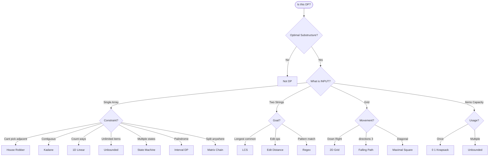

# DP Pattern Selection Decision Diagram

## Quick Reference

| Pattern | Input | Key Clue | Complexity |
|---------|-------|----------|------------|
| 1D Linear | Single array | Fixed prev states | O(n), O(1) |
| House Robber | Single array | Can't pick adjacent | O(n), O(1) |
| Kadane's | Single array | Contiguous subarray | O(n), O(1) |
| Unbounded | Items+Target | Unlimited usage | O(n×T), O(T) |
| 0/1 Knapsack | Items+Capacity | Each item once | O(n×W), O(W) |
| 2D Grid | Matrix | Grid traversal | O(mn), O(mn) |
| LCS | Two strings | Relative order | O(mn), O(min) |
| State Machine | Array+states | Multiple states | O(n), O(1) |
| Interval DP | String | Expanding intervals | O(n²) |
| Matrix Chain | Multiple items | Split anywhere | O(n³) |

## Decision Path

1. **Is it DP?** → Optimal substructure + overlapping subproblems
2. **Input type** → Single array, Two strings, Grid, or Items+Capacity
3. **Constraint/Goal** → Can't pick adjacent, Contiguous, Unlimited, Multiple states
4. **Match to pattern** → Use the table above
