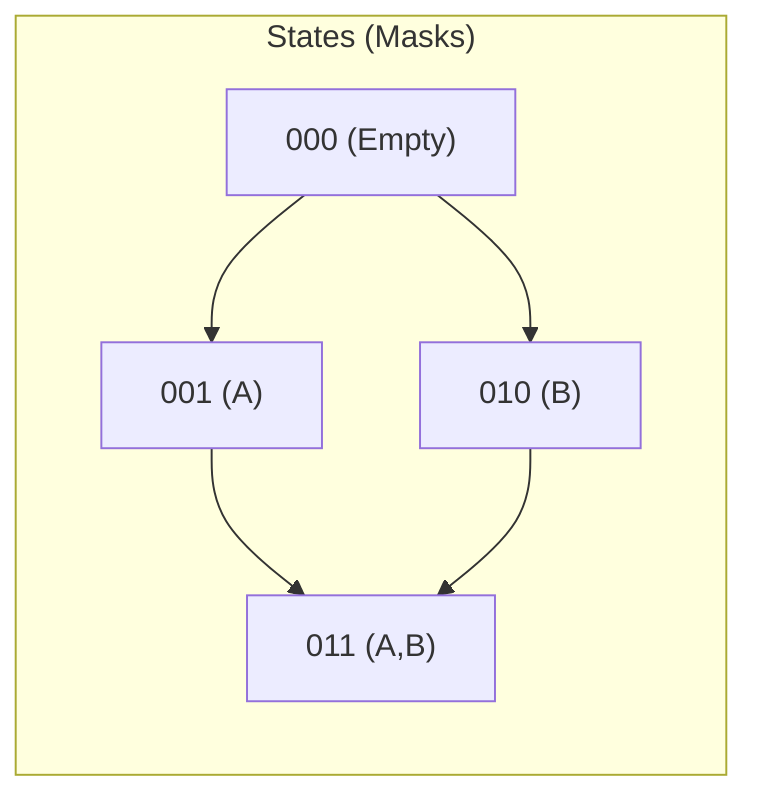

# Bitmask DP

> **Prerequisites:** [15-bit-manipulation](../15-bit-manipulation/README.md), [09-dynamic-programming](../09-dynamic-programming/README.md)

## Overview



Bitmask Dynamic Programming is a technique where we use a bitmask (an integer treated as a set of bits) to represent a state of items, visited nodes, or selected elements. This is typically used when the number of elements is small ($N \le 20$), as the number of states is $2^N$.

## Building Intuition

**Why use Bitmask DP?**

1.  **Representing Sets**: Instead of using a `tuple` or `frozenset` as a dictionary key (which is slow), we use an integer. If the $i$-th bit is 1, the $i$-th element is in the set.
2.  **State Transitions**:
    *   Add element $i$: `mask | (1 << i)`
    *   Check if element $i$ is in set: `mask & (1 << i)`
    *   Remove element $i$: `mask & ~(1 << i)`
    *   Iterate all subsets: `for sub in range(1 << N):`
3.  **Efficiency**: Bitwise operations are extremely fast, and array indexing `dp[mask]` is faster than hash map lookups.

**Complexity Note**:
- **Time**: $O(2^N \cdot \text{poly}(N))$
- **Space**: $O(2^N)$

---

## Template

The most common pattern is "finding an optimal path/selection through all items".

```python
def bitmask_dp_template(n: int) -> int:
    # dp[mask] = optimal value for subset 'mask'
    # or dp[mask][last_pos] for TSP-like problems
    dp = [float('inf')] * (1 << n)
    dp[0] = 0 # Base case

    for mask in range(1 << n):
        for i in range(n):
            if not (mask & (1 << i)):
                # Try adding i to the current subset
                new_mask = mask | (1 << i)
                dp[new_mask] = min(dp[new_mask], dp[mask] + cost(i, mask))

    return dp[(1 << n) - 1]
```

---

## Problem 1: Traveling Salesperson (TSP)

Find the shortest possible route that visits every city exactly once and returns to the starting city.

### Intuition
Standard DFS would be $O(N!)$. With Bitmask DP, we track `(visited_mask, current_city)`. There are $2^N$ masks and $N$ possible current cities, leading to $O(2^N \cdot N^2)$ time.

### Solution

```python
def tsp(graph: list[list[int]]) -> int:
    """
    Finds minimum cost to visit all nodes and return to 0.
    graph[i][j] is distance from i to j.
    """
    n = len(graph)
    # dp[mask][i] = min cost to visit nodes in 'mask' ending at city 'i'
    dp = [[float('inf')] * n for _ in range(1 << n)]

    # Starting point: city 0 visited, at city 0
    dp[1][0] = 0

    for mask in range(1, 1 << n):
        for last in range(n):
            if dp[mask][last] == float('inf'):
                continue

            # Try visiting next city 'curr'
            for curr in range(n):
                if not (mask & (1 << curr)):
                    new_mask = mask | (1 << curr)
                    dp[new_mask][curr] = min(
                        dp[new_mask][curr],
                        dp[mask][last] + graph[last][curr]
                    )

    # Return to city 0 from all cities where all cities were visited
    full_mask = (1 << n) - 1
    res = min(dp[full_mask][i] + graph[i][0] for i in range(1, n))
    return res
```

---

## Problem 2: Smallest Sufficient Team (LeetCode 1125)

Find the smallest number of people such that their collective skills cover all required skills.

### Intuition
Since there are few skills (max 16), we can represent the set of covered skills as a bitmask. For each person, we calculate their "skill mask" and update our DP table.

### Solution

```python
def smallest_sufficient_team(req_skills: list[str],
                             people: list[list[str]]) -> list[int]:
    n = len(req_skills)
    skill_to_idx = {skill: i for i, skill in enumerate(req_skills)}

    # dp[mask] = list of indices of people forming the team
    dp = {0: []}

    for i, p_skills in enumerate(people):
        # Calculate skill mask for this person
        p_mask = 0
        for skill in p_skills:
            if skill in skill_to_idx:
                p_mask |= (1 << skill_to_idx[skill])

        # Try updating all existing masks with this person
        # Create a copy of keys because we're modifying dp
        for mask, team in list(dp.items()):
            new_mask = mask | p_mask
            if new_mask not in dp or len(dp[new_mask]) > len(team) + 1:
                dp[new_mask] = team + [i]

    return dp[(1 << n) - 1]
```

---

## Summary Checklist

- [ ] $N \le 20$? Consider Bitmask DP.
- [ ] Base cases initialized (usually `dp[0]` or `dp[1 << start]`).
- [ ] Mask transitions correctly using bitwise OR/AND.
- [ ] For path problems, include the "last visited" index in the DP state: `dp[mask][last]`.
- [ ] For subset optimization, iterate masks from `0` to `2^N - 1`.
