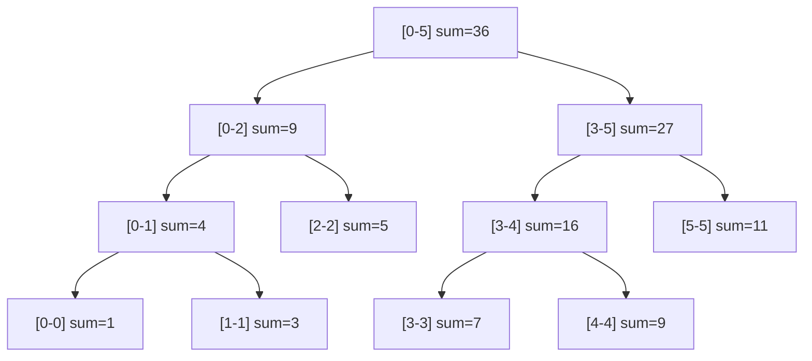

# Segment Tree

> **Prerequisites:** [06-trees](../06-trees/README.md), [11-recursion-backtracking](../11-recursion-backtracking/README.md)

## Overview

A Segment Tree is a versatile data structure used for storing information about intervals or segments. It allows querying which of the stored segments contains a given point and querying for range sums, minimums, maximums, etc., in $O(\log N)$ time. It also supports updates in $O(\log N)$.

## Core Operations

1.  **Build**: Create the tree from an input array in $O(N)$.
2.  **Point Update**: Update a single element and all affected segments in $O(\log N)$.
3.  **Range Query**: Query a property (sum, min, max) over an interval $[L, R]$ in $O(\log N)$.
4.  **Range Update (Lazy Propagation)**: Update all elements in an interval $[L, R]$ in $O(\log N)$.

## Visual Representation



For an array `[1, 3, 5, 7, 9, 11]` (indices 0-5):

---

## Implementation Template (Lazy Propagation)

This template implements a Segment Tree with support for Range Add and Range Sum.

```python
class SegmentTree:
    def __init__(self, data):
        self.n = len(data)
        self.tree = [0] * (4 * self.n)
        self.lazy = [0] * (4 * self.n)
        if self.n > 0:
            self._build(data, 1, 0, self.n - 1)

    def _build(self, data, node, start, end):
        if start == end:
            self.tree[node] = data[start]
            return
        mid = (start + end) // 2
        self._build(data, 2 * node, start, mid)
        self._build(data, 2 * node + 1, mid + 1, end)
        self.tree[node] = self.tree[2 * node] + self.tree[2 * node + 1]

    def _push(self, node, start, end):
        if self.lazy[node] != 0:
            self.tree[node] += (end - start + 1) * self.lazy[node]
            if start != end:
                self.lazy[2 * node] += self.lazy[node]
                self.lazy[2 * node + 1] += self.lazy[node]
            self.lazy[node] = 0

    def update_range(self, l, r, val):
        self._update(1, 0, self.n - 1, l, r, val)

    def _update(self, node, start, end, l, r, val):
        self._push(node, start, end)
        if start > end or start > r or end < l:
            return
        if start >= l and end <= r:
            self.lazy[node] += val
            self._push(node, start, end)
            return
        mid = (start + end) // 2
        self._update(2 * node, start, mid, l, r, val)
        self._update(2 * node + 1, mid + 1, end, l, r, val)
        self.tree[node] = self.tree[2 * node] + self.tree[2 * node + 1]

    def query_range(self, l, r):
        return self._query(1, 0, self.n - 1, l, r)

    def _query(self, node, start, end, l, r):
        self._push(node, start, end)
        if start > end or start > r or end < l:
            return 0
        if start >= l and end <= r:
            return self.tree[node]
        mid = (start + end) // 2
        p1 = self._query(2 * node, start, mid, l, r)
        p2 = self._query(2 * node + 1, mid + 1, end, l, r)
        return p1 + p2
```

---

## Complexity Analysis

| Operation | Complexity | Note |
| :--- | :--- | :--- |
| **Build** | $O(N)$ | $4N$ nodes are created. |
| **Query** | $O(\log N)$ | Standard tree traversal. |
| **Update** | $O(\log N)$ | Point or Range (with Lazy Prop). |
| **Space** | $O(N)$ | $4N$ is the standard safe size. |

---

## Common Variants

1.  **Iterative Segment Tree**: More space-efficient and faster, but harder to implement Lazy Propagation.
2.  **Dynamic Segment Tree**: Nodes are created on-demand, useful for very large ranges (e.g., $10^9$) when the number of updates is small.
3.  **2D Segment Tree**: For range queries on a grid.

## Summary Checklist

- [ ] Is the operation associative (e.g., sum, min, max, gcd)?
- [ ] For range updates, can the update be "pushed" to children?
- [ ] Array size $4N$ handles the complete binary tree structure.
- [ ] Base cases in recursion (out of bounds, full overlap).
