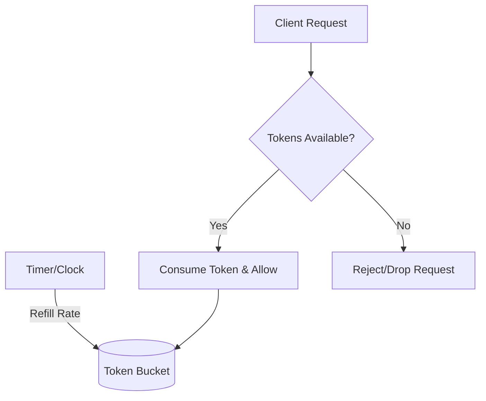

# Common Concurrency Problems

These are high-level designs for classic concurrency problems frequently asked in Senior/Staff engineering interviews.

## 1. Bounded Blocking Queue
A queue with a fixed capacity where `enqueue` blocks if full and `dequeue` blocks if empty.

### Implementation Logic
Uses a **Lock** and two **Condition Variables** (`not_full`, `not_empty`).

```python
import threading
from collections import deque

class BoundedBlockingQueue:
    def __init__(self, capacity: int):
        self.capacity = capacity
        self.queue = deque()
        self.lock = threading.Lock()
        self.not_full = threading.Condition(self.lock)
        self.not_empty = threading.Condition(self.lock)

    def enqueue(self, element: int) -> None:
        with self.not_full:
            while len(self.queue) == self.capacity:
                self.not_full.wait()
            self.queue.append(element)
            self.not_empty.notify()

    def dequeue(self) -> int:
        with self.not_empty:
            while len(self.queue) == 0:
                self.not_empty.wait()
            res = self.queue.popleft()
            self.not_full.notify()
            return res
```

---

## 2. Rate Limiter (Token Bucket)



Allows bursts up to a capacity, but limits the average rate of requests.

### Intuition
Tokens are added to a bucket at a fixed rate. Each request consumes a token. If the bucket is empty, the request is rejected or blocked.

```python
import time
import threading

class TokenBucket:
    def __init__(self, rate: int, capacity: int):
        self.rate = rate # tokens per second
        self.capacity = capacity
        self.tokens = capacity
        self.last_refill = time.time()
        self.lock = threading.Lock()

    def consume(self, amount=1):
        with self.lock:
            now = time.time()
            # Refill tokens based on elapsed time
            elapsed = now - self.last_refill
            self.tokens = min(self.capacity, self.tokens + elapsed * self.rate)
            self.last_refill = now

            if self.tokens >= amount:
                self.tokens -= amount
                return True
            return False
```

---

## 3. Dining Philosophers
$N$ philosophers sit at a round table with one chopstick between each pair. To eat, they need both chopsticks.

### The Deadlock Risk
If every philosopher picks up their left chopstick first, they all wait forever for the right one.

### Deadlock Avoidance Strategies
1.  **Hierarchy**: Philosophers always pick up the lower-numbered chopstick first (Resource Hierarchy Solution).
2.  **Arbitrator**: Use a semaphore to only allow $N-1$ philosophers to sit at the table at once.
3.  **Odd/Even**: Odd-numbered philosophers pick left then right; Even-numbered pick right then left.

---

## 4. Read-Write Lock
Multiple readers can hold the lock simultaneously, but only one writer can hold it (and no readers can hold it at the same time).

### Design Goals
*   **No Starvation**: Ensure writers aren't blocked forever by a constant stream of readers (Reader Preference vs. Writer Preference).
*   **Reentrancy**: Can a reader upgrade to a writer? (Usually very complex/unsafe).
