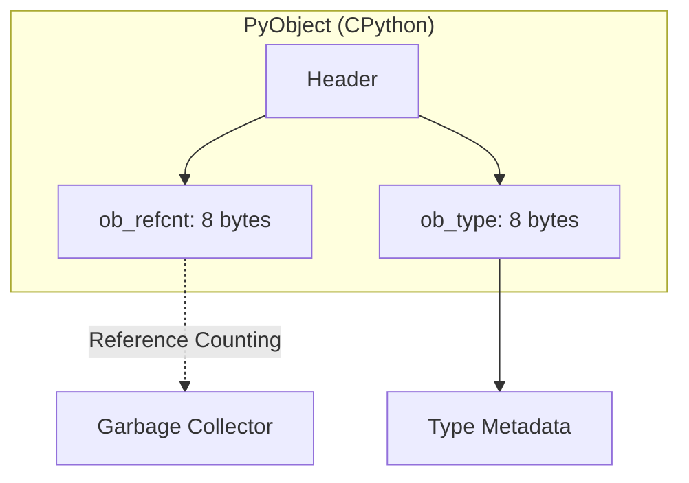

# Memory Management

For Senior and Staff engineers, understanding Python's memory management is critical for optimizing high-performance applications and debugging memory leaks in large-scale systems.

## 1. The Python Object Model



In CPython, everything is an `PyObject`.

```c
typedef struct _object {
    _PyObject_HEAD_EXTRA
    Py_ssize_t ob_refcnt;
    struct _typeobject *ob_type;
} PyObject;
```

*   **Reference Counting (`ob_refcnt`)**: Every object tracks how many references point to it.
*   **Type Pointer (`ob_type`)**: Points to a type object that defines the behavior of the object (e.g., how to add it, its size).

### Variables are References
In Python, variables are names bound to objects. They are not memory locations that hold values (unlike C).
```python
a = [1, 2, 3]
b = a  # b now points to the same object as a. ob_refcnt increases.
```

---

## 2. Reference Counting (Primary GC)

Reference counting is Python's primary mechanism for memory management. It is **deterministic**: an object is destroyed as soon as its reference count hits zero.

### When does `refcnt` increase?
1.  Assignment (`a = obj`).
2.  Passing into a function.
3.  Adding to a container (list, dict, etc.).

### When does `refcnt` decrease?
1.  The reference goes out of scope.
2.  A variable is reassigned (`a = None`).
3.  The object is removed from a container.
4.  The container itself is deleted.

**Pros**: Immediate reclamation of memory.
**Cons**: Overhead of incrementing/decrementing on every assignment; cannot handle **Reference Cycles**.

---

## 3. Generational Garbage Collection (Secondary GC)

To handle reference cycles (e.g., `A` points to `B`, and `B` points to `A`), Python uses a cyclic garbage collector (`gc` module).

### The Concept of Generations
The GC classifies objects into three generations based on how many collection sweeps they have survived:
*   **Generation 0**: Newly created objects. Collected frequently.
*   **Generation 1**: Objects that survived Gen 0 collection.
*   **Generation 2**: Objects that survived Gen 1 collection. Collected least frequently.

**The Hypothesis**: Most objects die young ("Infant Mortality"). By focusing on younger objects, the GC remains efficient.

### The Collection Process
1.  **Detection**: The GC identifies all container objects (lists, dicts, instances).
2.  **Subtracting References**: It temporarily subtracts 1 from the reference count of every object referenced by another object in the generation.
3.  **Survivors**: Any object whose reference count is still $>0$ is reachable from outside the cycle and is "moved" to the next generation.
4.  **Reclamation**: Objects with a count of 0 are part of a cycle and are unreachable; they are deleted.

---

## 4. Optimization: `__slots__`

By default, Python instances use a `__dict__` to store attributes, which allows for dynamic attribute addition but consumes significant memory.

```python
class Point:
    __slots__ = ('x', 'y')  # Reserves space for exactly these attributes
    def __init__(self, x, y):
        self.x = x
        self.y = y
```

*   **Memory Impact**: Eliminates the `__dict__` and `__weakref__` per instance. For millions of objects, this can reduce memory usage by 40-50%.
*   **Performance**: Slightly faster attribute access.
*   **Trade-off**: You cannot add new attributes at runtime that aren't in `__slots__`.

---

## 5. Memory Allocation: PyMalloc

CPython uses a specialized allocator for small objects (<= 512 bytes) to avoid frequent calls to the system `malloc()`.

*   **Arenas**: 256KB chunks of memory aligned on 256KB boundaries.
*   **Pools**: 4KB blocks within arenas. Each pool contains blocks of a specific size.
*   **Blocks**: The actual memory segments allocated to objects.

This hierarchy reduces fragmentation and improves allocation speed for the high volume of small objects typical in Python programs.
