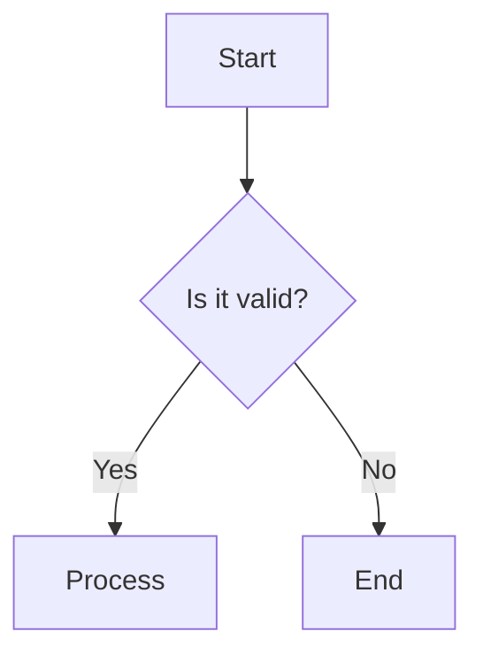
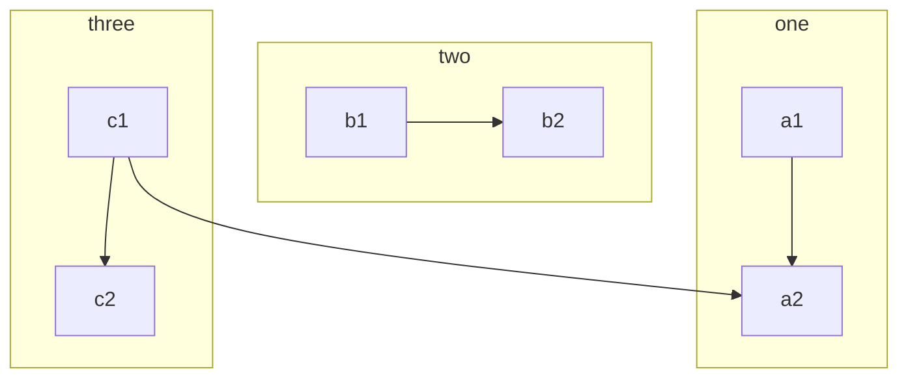
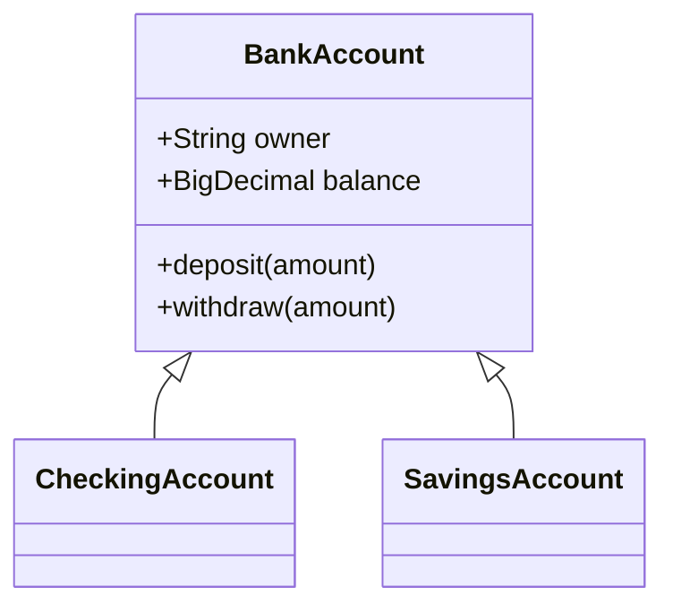
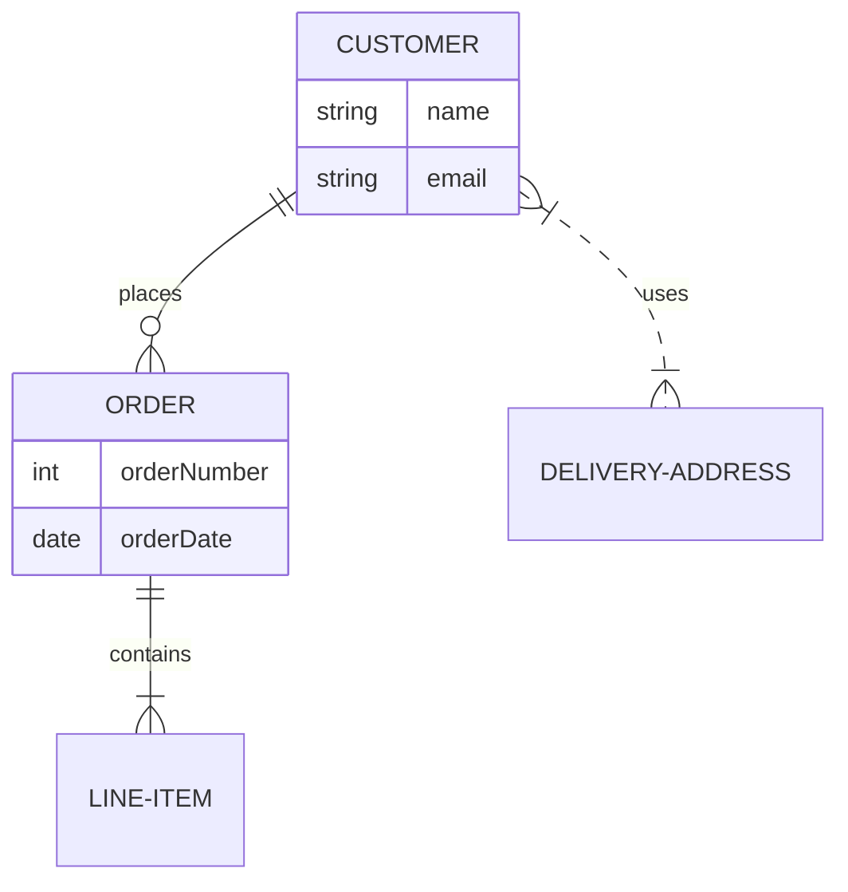
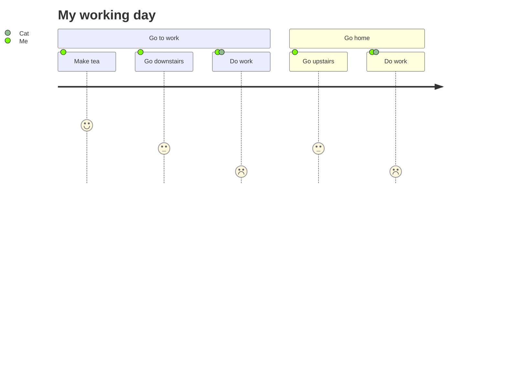
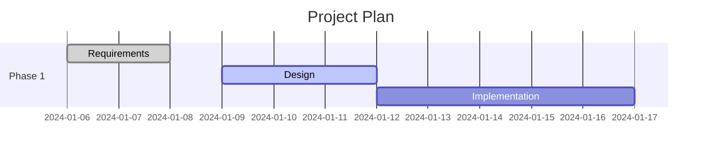

# Mermaid Diagrams Skill

This skill provides comprehensive guidelines, syntax details, and best practices for creating Mermaid diagrams embedded in Markdown files. Mermaid allows you to create complex diagrams and visualizations using simple text and code.

## 1. Basic Usage in Markdown

To embed a Mermaid diagram in a Markdown file (which renders natively on GitHub), use a code block with the language identifier `mermaid`:

```markdown

```

---

## 2. Flowcharts

Use `flowchart` or `graph` followed by the direction (`TB` / `TD` for top-down, `BT` for bottom-top, `RL` for right-left, `LR` for left-right).

### Node Shapes
- **Default:** `id1`
- **Box with text:** `id1[This is the text in the box]`
- **Rounded edges:** `id1(This is the text)`
- **Stadium-shaped:** `id1([This is the text])`
- **Subroutine:** `id1[[This is the text]]`
- **Cylinder (Database):** `id1[(Database)]`
- **Circle:** `id1((This is the text))`
- **Asymmetric:** `id1>This is the text]`
- **Rhombus (Decision):** `id1{This is the text}`
- **Hexagon:** `id1{{This is the text}}`
- **Parallelogram:** `id1[\This is the text\]`
- **Trapezoid:** `id1[/This is the text\]`

### Links
- **Link with arrow:** `A --> B`
- **Open link:** `A --- B`
- **Text on link:** `A -- text --> B` or `A -->|text| B`
- **Dotted link:** `A -.-> B`
- **Thick link:** `A ==> B`
- **Multi-directional:** `A <--> B`
- **Chaining:** `A --> B --> C`

### Subgraphs
Group related nodes into subgraphs.


---

## 3. Sequence Diagrams

Use `sequenceDiagram`. Great for documenting API flows or interactions between systems/users.

### Features
- **Participants/Actors:** Use `participant` or `actor`.
  ```mermaid
  sequenceDiagram
      actor U as User
      participant S as System
  ```
- **Messages:**
  - `->>`: Solid line with arrow (sync request)
  - `-->>`: Dotted line with arrow (async return/response)
  - `-x`: Solid line with a cross (async message)
- **Activations:**
  Use `activate` and `deactivate` or the shorthand `+` / `-`.
  ```mermaid
  sequenceDiagram
      Alice->>+John: Hello John, how are you?
      John-->>-Alice: Great!
  ```
- **Notes:**
  `Note right of [Actor]: Text` or `Note over [Actor1,Actor2]: Text`
- **Loops & Logic:**
  - `loop [Condition] ... end`
  - `alt [Condition] ... else [Condition] ... end` (If/Else)
  - `opt [Condition] ... end` (Optional)
  - `par [Action 1] ... and [Action 2] ... end` (Parallel)

---

## 4. Class Diagrams

Use `classDiagram`.

### Relationships
- `<|--` : Inheritance
- `*--` : Composition
- `o--` : Aggregation
- `-->` : Association
- `--` : Link (Solid)
- `..>` : Dependency
- `..|>` : Realization
- `..` : Link (Dashed)

### Multiplicity & Labels
`Customer "1" --> "*" Order : places`

### Visibility
- `+` Public
- `-` Private
- `#` Protected
- `~` Package/Internal

### Example


---

## 5. State Diagrams

Use `stateDiagram-v2`.

### Features
- **Start/End:** `[*]`
- **Transitions:** `State1 --> State2 : Transition text`
- **Composite States:**
  ```mermaid
  stateDiagram-v2
      [*] --> First
      state First {
          [*] --> Second
          Second --> [*]
      }
  ```
- **Concurrency:** Use `--` to split composite states into parallel regions.
- **Notes:** `note right of State1 : Text`

---

## 6. Entity Relationship Diagrams

Use `erDiagram`.

### Relationships & Cardinality
- `||--||` : Exactly one
- `||--o|` : Zero or one
- `||--o{` : Zero or more
- `||--|{` : One or more

### Example


---

## 7. User Journey Maps

Use `journey`. Useful for documenting user experiences.



---

## 8. Gantt Charts

Use `gantt`.



---

## GitHub Markdown Best Practices & Gotchas

1. **Avoid Hardcoded Colors/Themes:** GitHub supports light and dark modes. Custom styles (e.g., `style id1 fill:#f9f,stroke:#333`) often become invisible or illegible when the user switches themes. Rely on Mermaid's default themes which adapt automatically.
2. **Keep Width Manageable:** Extremely wide flowcharts (`LR`) or sequence diagrams can be clipped or require awkward horizontal scrolling on GitHub. Consider `TD` (Top-Down) or breaking large diagrams into smaller, logical sub-diagrams.
3. **Handle Special Characters Carefully:** Node text with quotes, brackets, or other special characters can break the parser. Enclose the text in quotes (e.g., `A["Complex text (with brackets)"]`) or use HTML entities.
4. **Use Descriptive Names/Labels:** Provide clear, short labels. For sequence diagrams, use concise messages to avoid text overflow.
5. **Comments:** You can add comments in Mermaid using `%%`. This is helpful for leaving notes for other developers without rendering them in the diagram.
   ```mermaid
   %% This is a comment and will not be rendered
   graph TD
       A --> B
   ```
6. **Subgraphs vs Performance:** Heavy use of nested subgraphs can occasionally cause GitHub's Mermaid renderer to time out. Flatten where possible if the diagram fails to render.